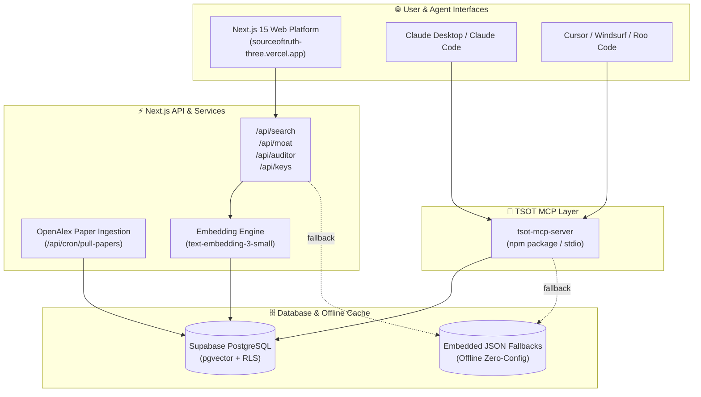

<div align="center">

# 🌐 The Sign of Times (TSOT)
### *Empirical Human-Computer Interaction (HCI) Research & EU AI Act Compliance Intelligence*

[](https://sourceoftruth-three.vercel.app/)
[](https://www.npmjs.com/package/tsot-mcp-server)
[](https://nextjs.org/)
[](https://supabase.com/)
[](https://modelcontextprotocol.io/)
[](https://opensource.org/licenses/MIT)

<p align="center">
  <a href="https://sourceoftruth-three.vercel.app/"><strong>Explore Web Platform »</strong></a> ·
  <a href="#-mcp-server-integration"><strong>Setup MCP Server »</strong></a> ·
  <a href="#-architecture"><strong>Architecture »</strong></a> ·
  <a href="#-developer-api"><strong>API Reference »</strong></a>
</p>

</div>

---

## 📖 Table of Contents

- [Overview](#-overview)
- [Live Platform](#-live-platform)
- [Core Registries](#-core-registries)
  - [1. Empirical HCI Research Ledger](#1-empirical-hci-research-ledger-9200-papers)
  - [2. EU AI Act Regulatory Database](#2-eu-ai-act-regulatory-database-all-124-articles)
- [Key Features](#-key-features)
- [Model Context Protocol (MCP) Server](#-model-context-protocol-mcp-server)
  - [Zero-Config Quickstart](#zero-config-quickstart)
  - [Claude Desktop Configuration](#claude-desktop-configuration)
  - [Cursor / Windsurf / Roo Code Setup](#cursor--windsurf--roo-code-setup)
  - [MCP Tools Reference](#mcp-tools-reference)
- [Architecture](#-architecture)
- [Developer REST API](#-developer-rest-api)
- [Getting Started Locally](#-getting-started-locally)
  - [Prerequisites](#prerequisites)
  - [Installation & Run](#installation--run)
  - [Environment Variables](#environment-variables)
- [Tech Stack](#-tech-stack)
- [Contributing & License](#-contributing--license)

---

## 🌟 Overview

**The Sign of Times (TSOT)** is an AI governance and design intelligence system that bridges **peer-reviewed Human-Computer Interaction (HCI) literature** with the statutory mandates of the **European Union Artificial Intelligence Act (Regulation EU 2024/1689)**.

Modern AI applications often suffer from **automation bias**, **cognitive offloading**, **epistemic erosion**, and **unintentional regulatory violations**. TSOT provides the foundational empirical backing, automated compliance auditing, and developer tooling necessary to design defensible, human-centered, and fully compliant AI systems.

---

## 🚀 Live Platform

Experience the full interactive suite online:

👉 **[https://sourceoftruth-three.vercel.app/](https://sourceoftruth-three.vercel.app/)**

* 🔍 **Semantic Search**: Sub-second hybrid search across thousands of empirical studies and statutory articles.
* ⚖️ **EU AI Act Explorer**: Filterable directory across all 124 articles categorized by risk tier and enforcement milestone.
* 🛡️ **Interactive Moat & Auditor**: Input product workflows to get instant compliance verdicts and cognitive threat assessments.
* 🔑 **Developer Console**: Generate scoped API keys, view live usage quotas, and inspect rate-limits.

---

## 📚 Core Registries

### 1. Empirical HCI Research Ledger (9,200+ Papers)
Synthesizes longitudinal studies and experiments across 5 core research pillars:

* 🧠 **Cognitive Offloading**: Measuring user verification decay when exposed to uninterrupted AI output streams.
* 🛑 **Automation Bias**: Analyzing the threshold shifts that cause professionals to defer judgment to probabilistic outputs.
* ⚡ **Response Latencies & Anthropomorphism**: Benchmarking user attachment and perceived intelligence against sub-200ms generation speeds.
* 🔭 **Epistemic Agency**: Tracking reductions in exploratory search depth and vocabulary variance caused by hyper-personalized interfaces.
* 🛡️ **Friction & Verification Gates**: Designing mandatory checkpoints, friction mechanisms, and counter-factual prompts.

### 2. EU AI Act Regulatory Database (All 124 Articles)
A complete, structured knowledge graph of **Regulation (EU) 2024/1689**:

* 🚫 **Prohibited Practices (Art. 5)**: Cognitive manipulation, biometric categorization, social scoring bans.
* ⚠️ **High-Risk AI Systems (Arts. 6–51)**: Risk management systems, data governance, logging, human oversight obligations.
* 💡 **Transparency & General Purpose AI (Arts. 50–56)**: Synthetic content watermarking, copyright disclosure, systemic risk evaluation.
* ⏱️ **Phased Enforcement Timelines**: Granular checklists mapped from Feb 2025 (Prohibitions) through Aug 2026 (Full High-Risk Enforcement).

---

## ⚡ Key Features

| Feature | Description |
| :--- | :--- |
| **Hybrid Vector Search** | Combines OpenAI `text-embedding-3-small` vector similarity with PostgreSQL full-text search fallback. |
| **Real-time Moat Synthesis** | Dynamic RAG pipeline generating evidence-backed design resolutions citing exact paper codes (`#SOT-...`) and articles (`#EU-ACT-ART-...`). |
| **Autonomous Paper Ingestion** | Background daemon continually pulling and ranking relevant HCI preprints and papers via the OpenAlex API. |
| **Dual Mode Offline/Cloud** | Bundles complete embedded fallback datasets for zero-dependency local or offline MCP execution. |
| **Tiered Key Infrastructure** | Built-in SHA-256 hashed API key management with rate-limiting and tier upgrades (`Free`, `Pro`, `Enterprise`). |

---

## 🔌 Model Context Protocol (MCP) Server

TSOT includes a production-ready, standalone **Model Context Protocol (MCP) server** published on npm as [`tsot-mcp-server`](https://www.npmjs.com/package/tsot-mcp-server).

### Zero-Config Quickstart

Run directly without installing:

```bash
npx -y tsot-mcp-server
```

### Claude Desktop Configuration

Add the following to your `claude_desktop_config.json`:

```json
{
  "mcpServers": {
    "tsot": {
      "command": "npx",
      "args": ["-y", "tsot-mcp-server"]
    }
  }
}
```

> **Config Path:**
> - **macOS:** `~/Library/Application Support/Claude/claude_desktop_config.json`
> - **Windows:** `%APPDATA%\Claude\claude_desktop_config.json`

### Cursor / Windsurf / Roo Code Setup

Configure a new **Stdio** MCP server in your editor settings:
- **Name:** `tsot`
- **Command:** `npx`
- **Args:** `-y tsot-mcp-server`

### MCP Tools Reference

| Tool Name | Parameters | Description |
| :--- | :--- | :--- |
| `audit_eu_compliance` | `prompt` (string) | Audits product UI/UX flows against EU AI Act risk levels and generates statutory checklists. |
| `optimize_hci_design` | `prompt` (string) | Recommends interaction patterns, friction gates, and cognitive scaffolding based on empirical papers. |
| `query_research_moat` | `query` (string) | Resolves strategic design dilemmas with cited evidence from the research ledger. |
| `search_registry` | `query` (string), `pillar?`, `limit?` | Hybrid semantic search across the Empirical HCI Research Ledger. |
| `search_ai_act` | `query` (string), `category?`, `limit?` | Searches across all 124 articles of the EU AI Act. |
| `get_record` | `code` (string), `source?` | Fetches full article text or research brief by code (e.g. `SOT-COMP-2026`, `EU-ACT-ART-5`). |

---

## 🏗️ Architecture



---

## 🔑 Developer REST API

All platform data is accessible via REST endpoints using your `tsot_live_...` API key:

### Authenticate Requests
Include your key in the `x-api-key` header:

```bash
curl -X POST https://sourceoftruth-three.vercel.app/api/search \
  -H "Content-Type: application/json" \
  -H "x-api-key: tsot_live_YOUR_KEY" \
  -d '{"query": "automation bias in medical triage", "limit": 5}'
```

### Key Endpoints

| Endpoint | Method | Description |
| :--- | :--- | :--- |
| `/api/search` | `POST` | Hybrid vector & keyword search over the research ledger and AI Act database. |
| `/api/search/synthesize` | `POST` | Generates a synthesized research brief citing exact ledger and article records. |
| `/api/moat` | `POST` | Resolves UX design dilemmas with empirical trade-off evaluations. |
| `/api/auditor` | `POST` | Runs a complete statutory & cognitive audit on an application spec. |
| `/api/keys` | `GET/POST/DELETE` | Manage developer API keys and inspect usage metrics. |

---

## 💻 Getting Started Locally

### Prerequisites
* **Node.js**: `v18.17.0` or later
* **npm** or **pnpm**
* **Supabase Account** *(optional; app gracefully falls back to local embedded datasets if unlinked)*

### Installation & Run

1. **Clone the repository:**
   ```bash
   git clone https://github.com/gibbity/TSOT.git
   cd TSOT
   ```

2. **Install root dependencies:**
   ```bash
   npm install
   ```

3. **Configure environment variables:**
   ```bash
   cp .env.example .env.local
   ```

4. **Start the local Next.js development server:**
   ```bash
   npm run dev
   ```
   Open [http://localhost:3000](http://localhost:3000) in your browser.

5. **Build for production:**
   ```bash
   npm run build
   npm start
   ```

### Environment Variables

```env
# Supabase Configuration
NEXT_PUBLIC_SUPABASE_URL=https://your-project.supabase.co
NEXT_PUBLIC_SUPABASE_ANON_KEY=your-anon-key
SUPABASE_SERVICE_ROLE_KEY=your-service-role-key

# AI Embeddings & Synthesis
OPENAI_API_KEY=sk-...
OPENAI_MODEL=gpt-4o-mini

# Cron Automation
CRON_SECRET=your-cron-secret
```

---

## 🛠️ Tech Stack

* **Framework:** [Next.js 15+](https://nextjs.org/) (App Router, Turbopack, Server Components)
* **Styling:** [Tailwind CSS](https://tailwindcss.com/) & Vanilla CSS with modern dark design system tokens
* **Icons & UI:** [Lucide Icons](https://lucide.dev/), `@radix-ui` primitives
* **Database & Vector Store:** [Supabase](https://supabase.com/) with PostgreSQL & `pgvector`
* **Embeddings & LLM:** [OpenAI](https://platform.openai.com/) (`text-embedding-3-small`, `gpt-4o-mini`)
* **Research Pipeline:** [OpenAlex REST API](https://openalex.org/)
* **Protocol Server:** [@modelcontextprotocol/sdk](https://modelcontextprotocol.io/)

---

## 📄 License

This project is licensed under the [MIT License](LICENSE).

---

<div align="center">
  <sub>Built with precision for ethical, defensible, and compliant human-AI systems.</sub><br>
  <sub><strong><a href="https://sourceoftruth-three.vercel.app/">https://sourceoftruth-three.vercel.app/</a></strong></sub>
</div>
