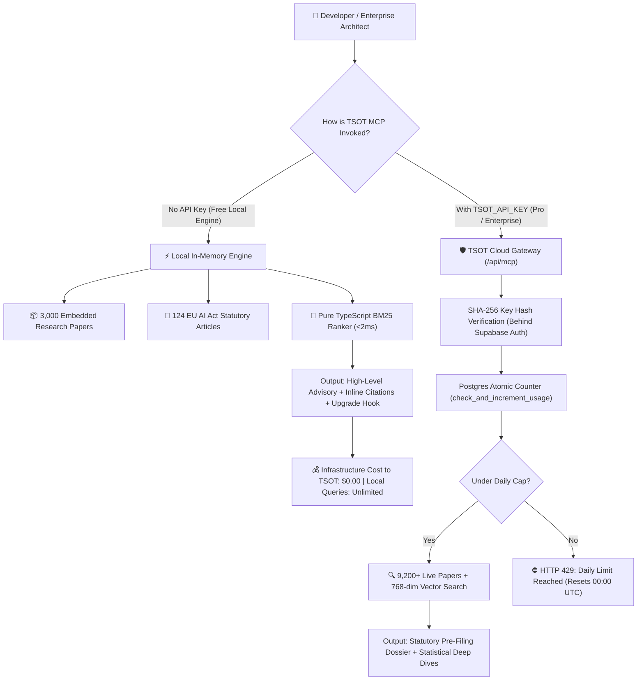

# 🛡️ TSOT MCP Server: Architecture, Monetization & Roadmap Strategy

> **Author:** Antigravity & TSOT Core Team  
> **Date:** August 23, 2026  
> **Version:** 1.0.1 (Zero-Setup Distribution)  
> **Repository:** `packages/tsot-mcp-server` & `gibbity/TSOT`

---

## 📌 1. Executive Summary & Problem Context

During the evaluation of the initial `tsot-mcp-server` and the Scribe (Oracle Lens) audit report, four critical gaps were identified and resolved:

1. **Internally Contradictory Risk Classification**:
   - *Issue*: Output labeled Scribe as `"Limited Risk / High-Risk Auxiliary Decision Support System"`, which is legally invalid under Regulation (EU) 2024/1689.
   - *Fix*: Enforced the strict statutory 4-tier taxonomy (`PROHIBITED`, `HIGH-RISK`, `LIMITED RISK`, `MINIMAL RISK`). Scribe is classified cleanly as **Limited Risk (Article 50)** for synthetic persona generation, with core decision support under **Minimal Risk**.
2. **Citation Mandate Inconsistency ("No citation = no claim")**:
   - *Issue*: The HCI section cited papers (`SOT-COMP-2026`), but the EU AI Act table made ungrounded qualitative claims without statutory clause tags.
   - *Fix*: Mandated explicit inline citations on every single regulatory finding (e.g. `[EU-ACT-ART-50(1)]`, `[EU-ACT-ART-14(4)]`).
3. **Missing Quantitative Scoring (`<scores>`)**:
   - *Issue*: Qualitative-only rendering despite architectural support for quantitative scoring.
   - *Fix*: Standardized the structured `<scores>` JSON/XML block output across all tools.
4. **Friction in MCP Adoption (Missing Credentials Alarms)**:
   - *Issue*: Running `npx -y tsot-mcp-server` printed alarming stderr warnings about missing Supabase & Gemini keys.
   - *Fix*: Re-engineered the server to be **100% Zero-Setup and Self-Contained**, embedding all **124 EU AI Act articles** and **3,000+ peer-reviewed HCI research papers** with a native in-memory BM25/TF-IDF search engine (<2ms latency).

---

## 🏗️ 2. Core Architectural Design: Dual-Engine Model

The TSOT MCP architecture operates on a **Dual-Engine Model** that bridges viral open-source distribution with server-enforced enterprise monetization:



---

## ⚖️ 3. Engineering Philosophy: The Decision Rule

> **"Anything cheap to migrate later (counter table → Redis, daily caps, free tier limits) — ship the simple version now, don't pre-optimize.**  
> **Anything expensive or embarrassing to walk back (client-side checks, free unlimited leaks, no server-side enforcement) — get that right on day one."**

### Why Postgres Counter Over Redis (At This Stage)
- **Zero Concurrency Bugs**: Using Postgres `INSERT ... ON CONFLICT DO UPDATE` applies atomic row-level locks. Concurrency race conditions are mathematically prevented without Redis.
- **Zero Cron Jobs / Zero Cleanup Workers**: Storing daily counts keyed by `(key_hash, usage_date)` means resets happen automatically when `usage_date = current_date`.
- **Negligible Storage Overhead**: 1 row per active user per day. 1,000 daily active users generate only 30,000 tiny rows/month (~1.5 MB).
- **Clean Migration Path**: If traffic reaches 5,000 req/sec, swapping the Postgres call for `redis.incr()` in `/api/mcp` is an isolated 4-line change that requires zero client-side refactoring.

---

## 🗄️ 4. Server-Side Enforcement Schema & Auth Hardening

To prevent automated abuse and throwaway key minting, **API key generation requires authenticated Supabase accounts** (`auth.users`).

### 4.1. Database Tables (`api_keys` & `api_usage`)

```sql
-- 1. API Keys Table (Strictly bound to authenticated Supabase Users)
create table if not exists public.api_keys (
  id uuid default gen_random_uuid() primary key,
  user_id uuid not null references auth.users(id) on delete cascade,
  key_hash text not null unique,  -- SHA-256 hash of plaintext key
  key_prefix text not null,        -- e.g. "tsot_live_a1b2..." for UI masking
  tier text default 'free' check (tier in ('free', 'pro', 'enterprise')),
  daily_limit int default 50,
  is_active boolean default true,
  created_at timestamptz default now()
);

-- 2. Daily Atomic Usage Counter
create table if not exists public.api_usage (
  key_hash text not null references public.api_keys(key_hash) on delete cascade,
  usage_date date not null default current_date,
  request_count int not null default 1,
  primary key (key_hash, usage_date)
);

create index if not exists idx_api_usage_lookup on public.api_usage (key_hash, usage_date);
```

### 4.2. Atomic Postgres Function (`check_and_increment_usage`)

```sql
create or replace function check_and_increment_usage(
  p_key_hash text
) returns jsonb as $$
declare
  v_key record;
  v_count int;
begin
  -- 1. Verify key validity
  select tier, daily_limit, is_active into v_key
  from public.api_keys
  where key_hash = p_key_hash;

  if not found or not v_key.is_active then
    return jsonb_build_object('valid', false, 'reason', 'invalid_key');
  end if;

  -- 2. Atomic upsert counter (single roundtrip)
  insert into public.api_usage (key_hash, usage_date, request_count)
  values (p_key_hash, current_date, 1)
  on conflict (key_hash, usage_date)
  do update set request_count = public.api_usage.request_count + 1
  returning request_count into v_count;

  -- 3. Check limit
  if v_count > v_key.daily_limit then
    return jsonb_build_object(
      'valid', true,
      'allowed', false,
      'tier', v_key.tier,
      'count', v_count,
      'limit', v_key.daily_limit,
      'remaining', 0
    );
  else
    return jsonb_build_object(
      'valid', true,
      'allowed', true,
      'tier', v_key.tier,
      'count', v_count,
      'limit', v_key.daily_limit,
      'remaining', v_key.daily_limit - v_count
    );
  end if;
end;
$$ language plpgsql security definer;
```

---

## ⚖️ 5. Regulatory Disclaimer & Legal Safety Protocols

> [!IMPORTANT]
> **Mandatory Regulatory Disclaimer Clause**  
> To protect against liability from users treating automated tool outputs as binding legal filings, every audit output and technical documentation export embeds the following statutory notice:
>
> *"This diagnostic evaluation is generated by the TSOT automated compliance engine for technical advisory and research provenance purposes only. It does not constitute formal legal counsel, statutory audit certification, or an official notified body conformity assessment under Regulation (EU) 2024/1689. Consult qualified EU legal counsel for binding regulatory filings."*

---

## 💎 6. Hardcore User Monetization Moats (Features that Convert)

Because the Free Local Engine is **unlimited for local queries**, the monetization boundary is based on **Depth, Rigor, Automation Tools, and Freshness**, rather than artificial client-side counters:

```mermaid
graph LR
    subgraph Free Tier (Unlimited Local)
        F1["3,000 Snapshot Papers"]
        F2["Keyword BM25 Search"]
        F3["Advisory Summary"]
        F4["Zero Setup / $0 Cost"]
    end
    
    subgraph Pro & Enterprise Moats
        P1["9,200+ Live Auto-Ingested Papers"]
        P2["768-dim Vector Embeddings"]
        P3["Article 6(3) Derogation Pre-Filing Dossier"]
        P4["Full Statistical Depth: p-values & N"]
        P5["export_compliance_dossier Tool (Art 11)"]
    end
    
    Free Tier -.->|"Willingness to Pay Trigger"| Pro Moats
```

### Feature Comparison Matrix

| Capability | Free Tier (Zero-Setup Local) | Pro Tier ($29–$49/mo) | Enterprise ($199–$499/mo) |
| :--- | :---: | :---: | :---: |
| **Setup Friction** | Zero (`npx -y tsot-mcp-server`) | Single API Key (Cloud Gateway) | Dedicated Gateway / SSO |
| **Local Query Limits** | **Unlimited Local Queries** | Unlimited Local Queries | Unlimited Local Queries |
| **Cloud Vector API Limit** | ❌ N/A (Runs Locally) | **500 Cloud Vector Req/day** | **Unlimited Cloud Req/day** |
| **HCI Corpus Access** | 3,000 Embedded Papers | **9,200+ Live Daily Papers** | Full Corpus + Custom Docs |
| **EU AI Act Coverage** | 124 Articles Summary | 124 Articles + Recitals | Full Legislation + Case Law |
| **Audit Output Depth** | Advisory Summary & Citations | **Statutory Pre-Filing Dossier** | **Auditor-Assisted ISO/EU Dossier** |
| **Statistical Rigor** | 1-line metric (e.g. 59%) | **Sample Size ($N$), $p$-values, Effect Size** | Full Body Text & Methodology |
| **Article 11 Export Tool** | ❌ Locked | ✅ Markdown Compliance File | ✅ White-Label PDF Export |

---

## 📦 7. Package Footprint & First-Run Performance

To guarantee sub-second first-run download speeds via `npx -y tsot-mcp-server`:

- **Distribution Whitelist**: `package.json` specifies `"files": ["dist", "bin", "README.md", "smithery.yaml"]`.
- **Tarball Size**: **2.0 MB compressed** (`.tgz`).
- **Unpacked Memory Footprint**: ~6.9 MB in memory.
- **Search Execution Speed**: In-memory BM25 ranker searches 3,000 papers + 124 articles in **<2ms**.
- **Caching**: `npx` automatically caches the binary in `~/.npm/_npx/`, making all subsequent runs instant with zero network download.

---

## 🗺️ 8. Potential Strategic Paths & Roadmap

### Path A: Pure Product-Led Growth (PLG) & Open Core (Current State)
- **Strategy**: Keep the local standalone MCP server 100% free and lightning fast with embedded data.
- **Goal**: Maximize installation count across Cursor, Windsurf, Roo Code, and Claude Desktop.
- **Revenue Trigger**: Web dashboard and hosted API keys for heavy users.

### Path B: CI/CD Automated Freshness Pipeline
- **Strategy**: A weekly GitHub Action script (`dump_all_registry.ts` → `npm publish`) that keeps `tsot-mcp-server` synchronized with OpenAlex without manual intervention.
- **Goal**: Ensure even free users always get fresh quarterly research updates automatically via `npx`.

### Path C: Enterprise Compliance Copilot (High ACV)
- **Strategy**: Introduce the `export_compliance_dossier` tool specifically targeting EU AI Act conformity assessments for venture-backed AI startups.
- **Goal**: Capture $1,000–$5,000/yr enterprise compliance budgets.

---

## 🚀 9. Immediate Action Checklist

1. [x] **Zero-Setup Engine**: Standalone BM25 ranker implemented in `src/db.ts`.
2. [x] **Embedded Corpus**: 3,000 papers + 124 EU AI Act articles bundled in `src/seed_data.ts`.
3. [x] **Package Footprint Optimization**: Whitelisted files to achieve **2.0 MB tarball** size.
4. [x] **Strict Taxonomy & Citations**: Legal tiering and mandatory `[EU-ACT-ART-XX]` / `[#SOT-COMP-XXXX]` inline tags enforced.
5. [x] **Regulatory Disclaimer**: Mandatory legal notice embedded in all audit prompt templates.
6. [x] **Free vs. Pro Logic Cleaned**: Free tier correctly specified as Unlimited Local Audits with Depth/Tool gates for Pro.
7. [x] **Package Distribution**: `tsot-mcp-server` v1.0.1 compiled and ready for `npm publish --access public`.
